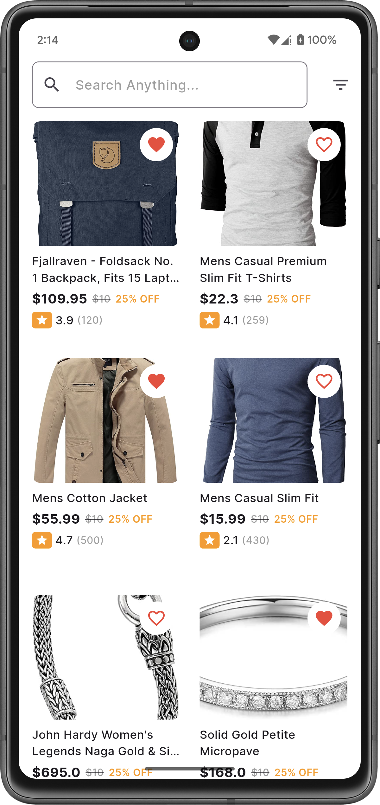
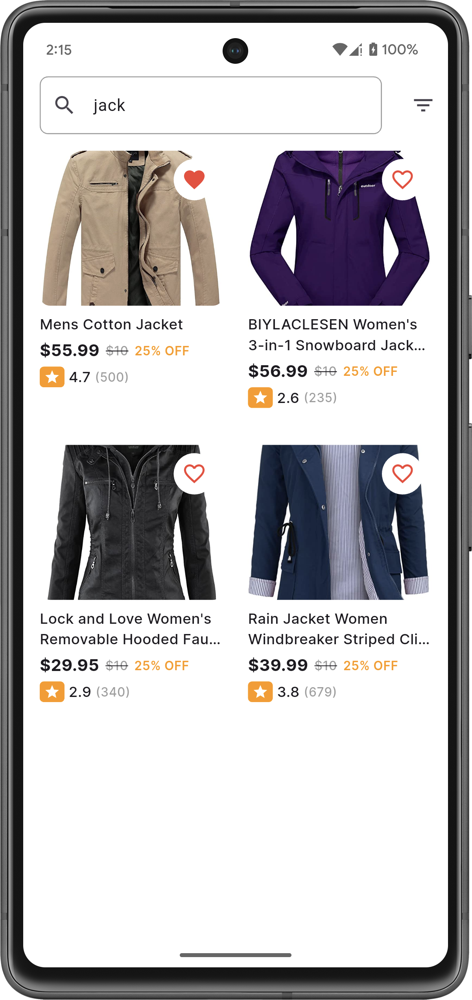
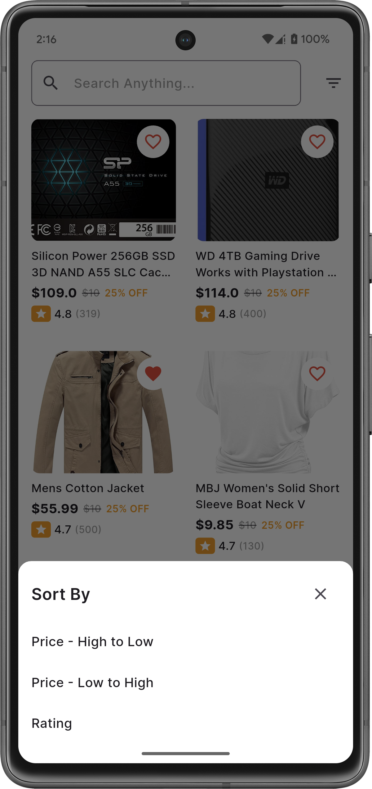

## 🛍️ E-Commerce Product Listing App

A feature-rich Flutter shopping app built for Qtec Solution Limited that demonstrates product listing, pagination, search, sorting, and offline support using BLoC state management and Clean Architecture.

## 🚀 Features
🛒 Product List  
📡 Fetched from FakeStoreAPI 
📜 Infinite scroll with mocked pagination 
🔍 Search & Filters 
🔤 Search products by name 
💰 Sort by Price (Low → High and High → Low) 
⭐ Sort by Rating 
📶 Offline and Online Mode 
📦 Automatically shows cached data when offline 
🔔 Snackbar alert when disconnected 

## 🧱 Tech Stack
🧩 Flutter 
🌐 Http  
🧠 BLoC 
💾 SQLite (for caching) 
📶 Connectivity Plus (network status) 
🏗️ Clean Architecture Pattern 
## 🌟 Screenshots

   &nbsp;&nbsp;&nbsp;
   &nbsp;&nbsp;&nbsp;
  

 
